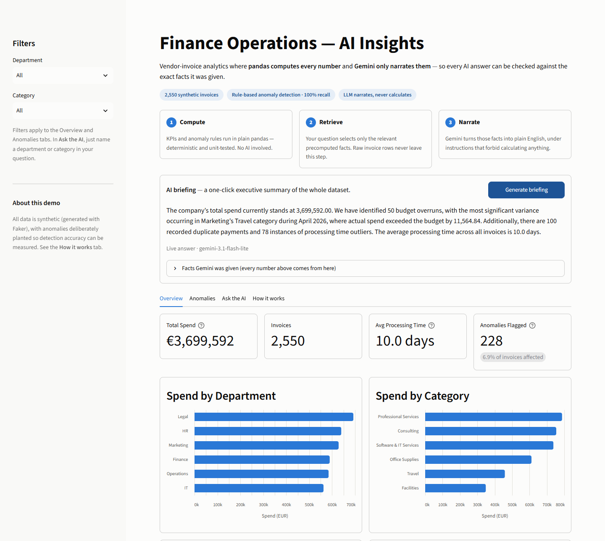
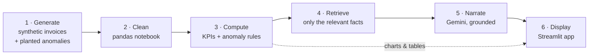
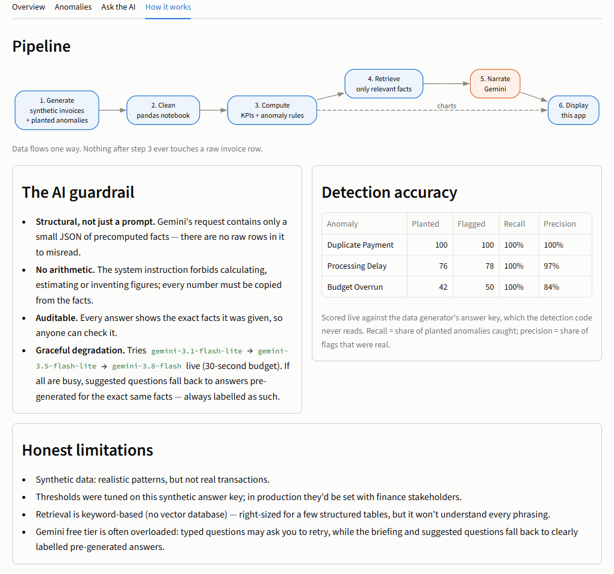
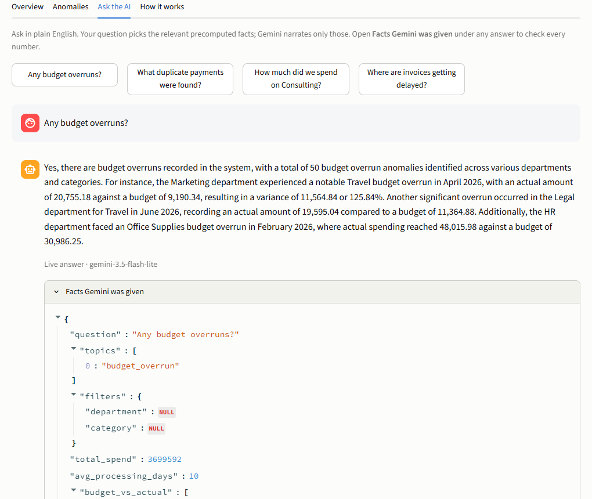
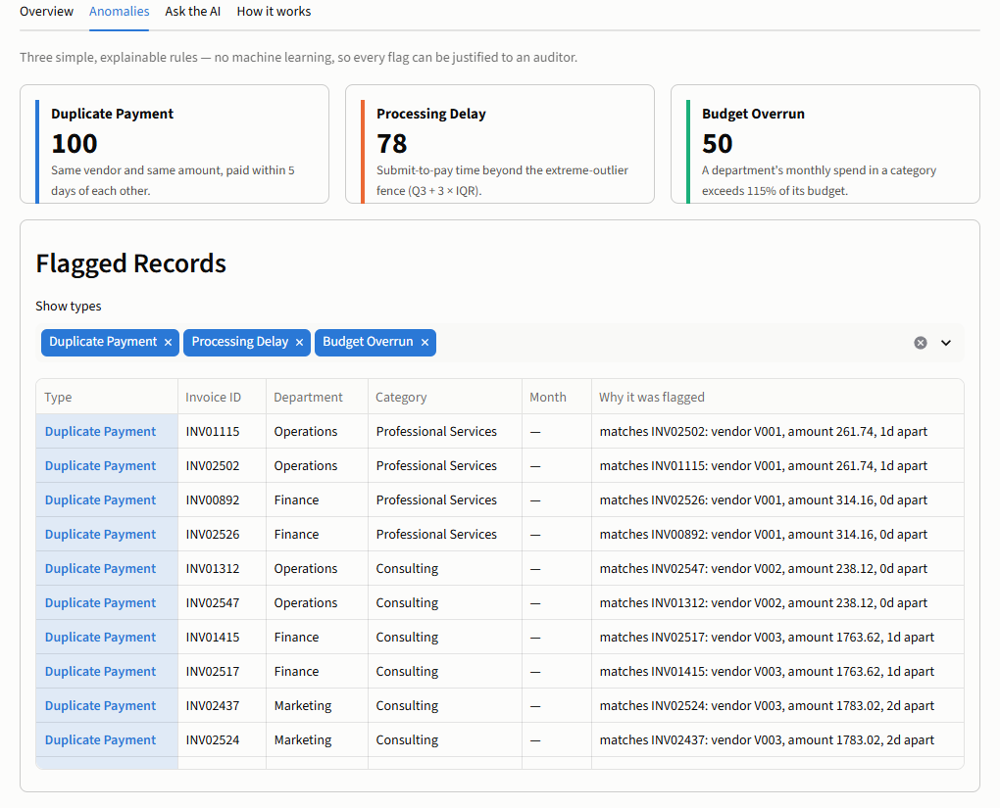

# Finance Ops AI Insights

**Vendor-invoice analytics where pandas computes every number and an LLM only narrates them — so every AI answer can be checked against the exact facts it was given.**


**Live demo:** _link added once deployed on Streamlit Community Cloud_



## In 30 seconds

- **The problem:** "AI finance dashboards" usually let the LLM read raw data and do the maths, so every answer is only as trustworthy as the model's arithmetic.
- **The approach:** deterministic pandas code computes the KPIs and flags anomalies; a retrieval step picks only the facts relevant to a question; Gemini turns those facts into plain English and is forbidden from calculating anything.
- **The evidence:** anomaly detection is scored live against a planted answer key — **100% recall on all three anomaly types** — and every AI answer ships with a "Facts Gemini was given" panel so anyone can audit it.
- **Built to keep working:** the free-tier LLM is often overloaded, so the app falls back across models and, as a last resort, to clearly labelled answers pre-generated for the exact same facts.

## Architecture



Data flows one way: **raw → cleaned → computed facts → retrieved subset → narrated → displayed.** Nothing after stage 3 ever touches a raw invoice row.

| Stage | Code | What it does |
|---|---|---|
| 1 | [`data/generate_data.py`](data/generate_data.py) | Faker-based invoices with planted anomalies (duplicate payments, budget overruns, processing delays) and realistic mess (inconsistent casing, mixed date formats, missing timestamps). Seeded and date-pinned, so it's fully reproducible. |
| 2 | [`notebooks/01_ingest_transform.ipynb`](notebooks/01_ingest_transform.ipynb) | Cleans and standardizes into `data/processed/`, with validation assertions before writing. Detects Databricks and switches to Unity Catalog storage automatically. |
| 3 | [`src/kpis.py`](src/kpis.py), [`src/anomalies.py`](src/anomalies.py) | Deterministic KPIs and three rule-based detectors — no LLM involved. |
| 4 | [`src/retrieval.py`](src/retrieval.py) | "RAG-lite": keyword/topic matching that selects which precomputed facts a question needs. No vector DB — the "documents" are a few structured tables, not prose. |
| 5 | [`src/insights.py`](src/insights.py), [`src/answers.py`](src/answers.py) | The only code that calls an LLM: a grounded prompt, a model fallback chain, and the pre-generated safety net. |
| 6 | [`app.py`](app.py) | Streamlit app with four tabs: **Overview**, **Anomalies**, **Ask the AI**, **How it works**. |



## Responsible AI: the guardrail is structural

1. **The LLM never sees raw data.** `retrieval.py` returns aggregated KPIs and already-flagged anomaly records, narrowed to the question. There are no invoice rows in the request for the model to misread.
2. **The LLM never calculates.** The system instruction ([`src/insights.py`](src/insights.py)) forbids arithmetic, estimation and invented figures: every number must be copied from the facts.
3. **Every answer is auditable.** The app shows the exact JSON the model received under each answer.
4. **Every answer is labelled with its source** — live (with the model name) or pre-generated (with model and date). A saved answer is keyed by a SHA-256 fingerprint of the facts it narrated, so it can never be shown for data it wasn't written about.

An LLM that narrates verified facts is far easier to trust, and to explain to a compliance or audit team, than one asked to compute figures on the fly.

<p align="center"></p>

## Anomaly detection, and how well it works

Three simple, explainable rules — deliberately not machine learning, so every flag can be justified:

| Anomaly | Rule | Planted | Flagged | Recall | Precision |
|---|---|---|---|---|---|
| Duplicate payment | Same vendor and amount, paid within 5 days | 100 | 100 | 100% | 100% |
| Processing delay | Submit-to-pay time above Q3 + 3 × IQR (Tukey's "extreme outlier" fence) | 76 | 78 | 100% | 97% |
| Budget overrun | Monthly department/category spend above 115% of budget | 42 | 50 | 100% | 84% |

Scored against the generator's answer key ([`src/evaluation.py`](src/evaluation.py)), which the detection code itself never reads. The same scorecard is computed live in the app's **How it works** tab.

Two tuning decisions worth calling out:
- **3 × IQR, not the textbook 1.5 ×:** processing times are naturally long-tailed, and 1.5 × produced 36 false positives.
- **The 8 budget false positives are left in on purpose.** They are groups that drifted past 115% through ordinary variance. A fixed tolerance threshold is how real budget policy works, so these are genuine "worth a look" cases, not detector bugs.



## Engineering highlights

- **17 pytest tests, run by GitHub Actions on every push:**
  - KPI sanity checks;
  - detection against the planted answer key;
  - the LLM fallback chain, with the network faked so CI never calls Gemini.
- **Graceful degradation:**
  - live models are tried in order, each with one attempt, under a 30-second budget;
  - a bad API key stops immediately instead of trying every model;
  - the pre-generated fallback is used only when every model fails.
- **Reproducible data:** a fixed seed and a pinned end date mean regenerating the data reproduces the committed files byte for byte.
- **Cost-aware:** the landing-page briefing is shared across visitors for 24 hours, so it costs one LLM call per day, not one per visitor.

## Run it locally

```powershell
git clone <repo-url>
cd finance-ops-ai-insights
python -m venv .venv
.venv\Scripts\activate
pip install -r requirements.txt

copy .env.example .env   # then add a free Gemini API key from aistudio.google.com
streamlit run app.py
```

The cleaned data is committed, so the app runs straight away. To rebuild the pipeline from scratch:

```powershell
python data/generate_data.py                  # 1. regenerate raw CSVs (identical output)
pip install jupyter
jupyter nbconvert --to notebook --execute --inplace notebooks/01_ingest_transform.ipynb   # 2. clean
python scripts/pregenerate_answers.py         # refresh fallback answers if the facts changed
pytest                                        # 17 tests
```

## Project structure

```
├── app.py                          # Streamlit app (4 tabs)
├── src/
│   ├── kpis.py                     # deterministic KPIs
│   ├── anomalies.py                # three rule-based detectors
│   ├── evaluation.py               # scores detectors against the answer key
│   ├── retrieval.py                # picks the facts a question needs
│   ├── insights.py                 # Gemini call: grounded prompt + model fallback chain
│   └── answers.py                  # live-first answers, pre-generated fallback
├── data/
│   ├── generate_data.py            # synthetic data + planted anomalies
│   ├── raw/                        # generated CSVs + anomaly answer key
│   ├── processed/                  # cleaned parquet (notebook output)
│   └── pregenerated/answers.json   # fallback answers, keyed by facts fingerprint
├── notebooks/01_ingest_transform.ipynb
├── scripts/pregenerate_answers.py
├── tests/                          # test_kpis.py, test_insights.py
├── docs/screenshots/
└── .github/workflows/ci.yml        # pytest on every push
```

## Honest limitations

- **Synthetic data.** Faker-generated invoices, vendors and budgets: realistic patterns, not real transactions.
- **Small anomaly set.** ~220 planted anomalies across 2,550 invoices — enough to validate detection logic, not to tune a production model.
- **Thresholds tuned on synthetic ground truth.** In a real deployment, the 115% overrun tolerance would be set with finance stakeholders, not fitted to a test set.
- **Keyword retrieval.** Right-sized for a few structured tables, but it won't understand every phrasing the way embedding search would.
- **Free-tier LLM.** Gemini's free tier is frequently overloaded. Typed questions may ask you to retry; the briefing and suggested questions fall back to pre-generated answers, always labelled as such.
- **Databricks.** The cleaning notebook is plain pandas (Spark isn't justified at ~2,500 rows) and is written to run on Databricks Free Edition. So far it has only been run locally.
- **No authentication, persistence or rate limiting** beyond what Streamlit Community Cloud and the Gemini free tier provide.

## Tech stack

Python 3.10+ · pandas · Faker · Gemini API (plain REST, no SDK) · Streamlit + Altair · pytest · GitHub Actions. No paid cloud services.
